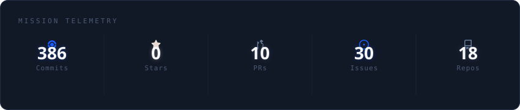

<!-- Galaxy Profile README Template
     Customize this file with your own info, then rename it to README.md
     in your GitHub profile repo (github.com/YOUR_USERNAME/YOUR_USERNAME).
     The SVG paths below point to assets/generated/ which are auto-generated
     by the GitHub Actions workflow or by running: python -m generator.main -->

  

 

  

 

  

 

  

 

<strong>More about me</strong>

 

BSIT Student passionate about systems programming and compiler design.

Forging tools in Rust & C. Interested in mid to high-level architecture and transpiler design.

**Currently at** Davao City, Philippines

**Focus Areas:**
- Systems Programming
- Mid to High-Level Architecture
- Compiler & Transpiler Design (built my own basic language!)
- Legacy Maintainer
- Low-level Management
- Poetry

 

  
  
  
  

